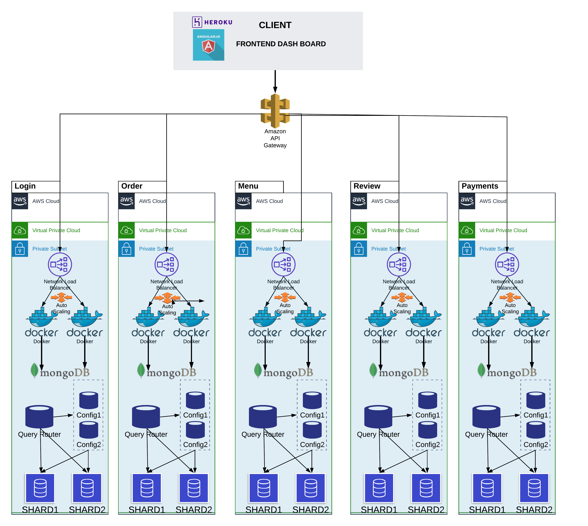

# Pizza My Heart <3

<h2>By the Go Getters <3</h2>
An online pizza ordering application **cloud scaled SaaS service** on Amazon Cloud and Heroku.

Technologies used: AngularJS, Go, MongoDB database, AWS, Heroku.

## Architecture

# Team Members

- [Kowshhal Vuppu ](https://github.com/kowshhal97)
- [Shivangi Jain](https://github.com/shivangi-jain)
- [Naman Agrawal](https://github.com/agrawalnaman)
- [Pavani Somarouthu](https://github.com/pavanisoma)
- [Anjana Menon](https://github.com/AnjanaMenonCherubala)

The repository has the following structure:

- Documentation - Individual API documentation, overall documentation, project journal and diagrams
- APIs - Go API source code
- frontend - AngularJS source code

# Modules

 _______________________
| Name     | Implementor|
|----------|------------|
| Login    | Kowshhal   |
| Menu     | Anjana     |
| Order    | Shivangi   |
| Payments | Pavani     |
| Reviews  | Naman      |
-------------------------

# Steps to Run the App

Go to the frontend directory

    cd frontend

Install all the required packages

    npm install

Run the React Server

    npm start

# AKF Scale Cube Aspects Covered:

## X-axis Scaling: 

 - X-axis scaling or Horizontal duplication refers to running multiple identical copies of the application behind a load  
 balancer. 
 -  We have demonstrated this aspect by running each API on multiple docker hosts. These docker hosts have been placed behind AWS Network Load Balncers to ensure that the service will remain up in the event that one of the servers running the API goes down . 
     

## Y-axis Scaling:

 - Y axis scaling refers to functional decomposition of a monolith service , that is breaking one huge service into multiple microservices.  
 - This aspect been implemented by separating all the services to function independently into the following APIs:
  - Login API
  - Menu API
  - Order API
  - Payment API
  - Review API
 

## Z-axis Scaling:

 - Z axis scaling refers to splitting similar data among different servers such thaat each server has 1/Nth of the data. 
 - This has been achieved in the case of this application by using MongoDB sharded cluster with 2 config servers, 2 sharded replica sets and 1 mongos query router server. MongoDb has been used to store login, item details, order details, payment details and reviews provided  

## CAP Theorem

- C : Consistency

A guarantee that every node in a distributed cluster returns the same, most recent, successful write. Consistency refers to every client having the same view of the data. 

- A : Availibility

Every node that is up returns a response for all read and write requests in a reasonable amount of time. The key word here is every. To be available, every node on (either side of a network partition) must be able to respond in a reasonable amount of time

- P : Partitioning

Our system continues to function and upholds its consistency guarantees in spite of partitions. Network partitions are a fact of life. Distributed systems guaranteeing partition tolerance can gracefully recover from partitions once the partition heals

---

